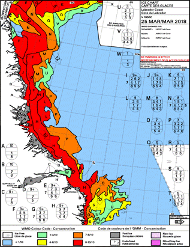
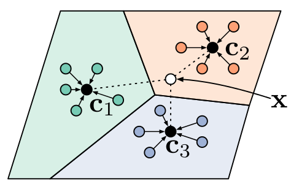
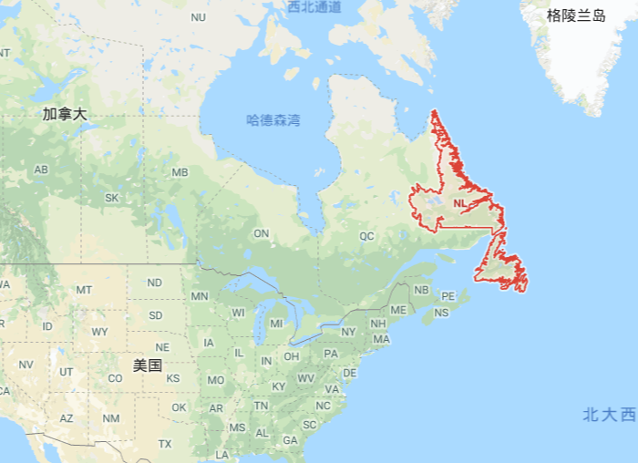

# 20180411

本周为技术学习周，主要学习人像分割的C++代码，然后共同讨论其实现过程。

代码链接如下：https://summitgao.github.io/new/opencv/lesson_ppseg.html

由高云浩和王群进行汇报。

##上周工作总结：

冰情图是海冰分析员主要依据SAR图像，辅以其它各种基础数据，根据视觉上的相似性将SAR图像分割成一系列子区域，并为每个子区域表明相应的蛋码（egg code）得到。加拿大冰服务局（Canadian Ice Seveice,CIS）是加拿大气象服务局的分支机构，主要负责提供准确、及时的加拿大通航水域内冰情信息。

冰情图下载地址：
http://iceweb1.cis.ec.gc.ca/Prod/page2.xhtml?CanID=11091&lang=en&title=East+Coast 

Manual of Ice阅读地址：
https://www.canada.ca/en/environment-climate-change/services/weather-manuals-documentation/manice-manual-of-ice.html

除此以外，我们还讨论了小样本学习中的Protypical Networks：

该方法思想十分简单高效，效果也非常好。它学习一个度量空间， 通过计算和每个类别的原型表达的距离来进行分类。文章基于这样的想法：每个类别都存在一个聚在某单个原型表达周围的embedding，该类的原型是support set在embedding空间中的均值。然后，分类问题变成在embedding空间中的最近邻。如图，c1、c2、c3分别是三个类别的均值中心（称Prototype），将测试样本x进行embedding后，与这3个中心进行距离计算，从而获得x的类别。

建议王栋继续深入学习一下Protypical networks，然后在我们的数据处理中应用一下。

##本周工作总结

李艳东：仔细阅读了LBP-ELM代码。**（这个代码非常关键，看十遍也不为过）**

王栋：配置了code blocks+VS2010+opencv2.4.1。研究了CIS冰情图，为华为杯做准备。**（成功运行了我提供的代码，非常不容易，希望继续研究清楚代码的工作原理，这个是图像处理程序员的基础，建议进一步推进protypical network的研究，跑跑官方示例代码）**

王群：下载了Labrador coast的图像，与冰情图位置对比，为之后海冰密集度实验做准备。**（大家想学习下载免费SAR数据的话，可以联系王群，她比较清楚数据的下载方法。Labrador是加拿大非常具有代表性的一个区域，也靠近格陵兰岛了，以后可以考虑作为我们重点关注的一个区域。）**

王晓：为PRCV的论文做准备，主要思路是 显著性 + SAE，同时练习C++编程。**（论文要积极的写作，C++技术能力也要努力提高，两方面都要准备，注意合理分配时间）**

高云浩：本周对于DFFN的网络代码进行进一步调试，网络仍然存在问题：对于而分类问题每次都会偏向分于第一类。尝试了修改标签、减少卷积核数量、缩减网络结构等方法，问题仍然存在。研究人像分割的代码，代码中训练和测试部分的基本原理不是很明白。**（这方面我会积极的抽空给你看看）**

王俊杰：最近在看西瓜书，同进，积极地推进毕业设计。**（平时不在信息楼，多保持沟通，有不明白的多问。这个学期课比较多，又赶上教学评估，精力有些不够啊~~~）**

此外，今天提到建立一个github技术博客，有助于未来找工作，仔细想想是这样的，别的东西可以造假，但个人思考学习进步的过程是造不了的。同时，可以把自己能跑的示例代码也挂在上面，这样找工作的时候，就可以给人看自己的博术博客，同时，也还有几个自己帮的DEMO可以演示，让人感觉你读研期间做了很多工作，非常充实。

[--->返回小组博客首页](./RSIPResearchBlog.html)

