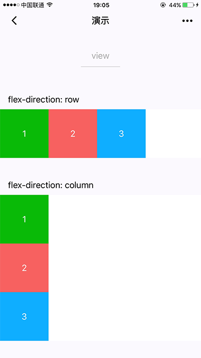
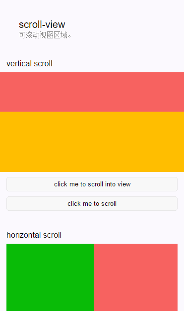

# 3.1 视图容器

[TOC]


## 1. view 视图容器

| 属性名                 | 类型    | 默认值 | 说明                                                         | 最低版本                                                     |
| ---------------------- | ------- | ------ | ------------------------------------------------------------ | ------------------------------------------------------------ |
| hover-class            | String  | none   | 指定按下去的样式类。当 `hover-class="none"` 时，没有点击态效果 |                                                              |
| hover-stop-propagation | Boolean | false  | 指定是否阻止本节点的祖先节点出现点击态                       | [1.5.0](https://developers.weixin.qq.com/miniprogram/dev/framework/compatibility.html) |
| hover-start-time       | Number  | 50     | 按住后多久出现点击态，单位毫秒                               |                                                              |
| hover-stay-time        | Number  | 400    | 手指松开后点击态保留时间，单位毫秒                           |                                                              |

示例代码如下：

index.wxml

```html
<view class="section">
  <view class="section__title">flex-direction: row</view>
  <view class="flex-wrp" style="flex-direction:row;">
    <view class="flex-item bc_green">1</view>
    <view class="flex-item bc_red">2</view>
    <view class="flex-item bc_blue">3</view>
  </view>
</view>
<view class="section">
  <view class="section__title">flex-direction: column</view>
  <view class="flex-wrp" style="height: 300px;flex-direction:column;">
    <view class="flex-item bc_green">1</view>
    <view class="flex-item bc_red">2</view>
    <view class="flex-item bc_blue">3</view>
  </view>
</view>
```

index.wxss

```css
.page-section{
margin-bottom: 20rpx;
}
.flex-wrp {display: flex;}
.bc_green {background: green;width:100px; height: 100px;}
.bc_red {background: red;width:100px; height: 100px;}
.bc_blue {background: blue;width:100px; height: 100px;}
```

效果图:




##2. scrolll-view  可滚动视图区域

| 属性名                | 类型        | 默认值 | 说明                                                         |
| --------------------- | ----------- | ------ | ------------------------------------------------------------ |
| scroll-x              | Boolean     | false  | 允许横向滚动                                                 |
| scroll-y              | Boolean     | false  | 允许纵向滚动                                                 |
| upper-threshold       | Number      | 50     | 距顶部/左边多远时（单位px），触发 scrolltoupper 事件         |
| lower-threshold       | Number      | 50     | 距底部/右边多远时（单位px），触发 scrolltolower 事件         |
| scroll-top            | Number      |        | 设置竖向滚动条位置                                           |
| scroll-left           | Number      |        | 设置横向滚动条位置                                           |
| scroll-into-view      | String      |        | 值应为某子元素id（id不能以数字开头）。设置哪个方向可滚动，则在哪个方向滚动到该元素 |
| scroll-with-animation | Boolean     | false  | 在设置滚动条位置时使用动画过渡                               |
| enable-back-to-top    | Boolean     | false  | iOS点击顶部状态栏、安卓双击标题栏时，滚动条返回顶部，只支持竖向 |
| bindscrolltoupper     | EventHandle |        | 滚动到顶部/左边，会触发 scrolltoupper 事件                   |
| bindscrolltolower     | EventHandle |        | 滚动到底部/右边，会触发 scrolltolower 事件                   |
| bindscroll            | EventHandle |        | 滚动时触发，event.detail = {scrollLeft, scrollTop, scrollHeight, scrollWidth, deltaX, deltaY} |

使用竖向滚动时，需要给`<scroll-view/>`一个固定高度，通过 WXSS 设置 height。

示例代码如下：

index.js

```js
var order = ['red', 'yellow', 'blue', 'green', 'red']
Page({
  data: {
    toView: 'red',
    scrollTop: 100
  },
  upper: function (e) {
    console.log(e)
  },
  lower: function (e) {
    console.log(e)
  },
  scroll: function (e) {
    console.log(e)
  },
  tap: function (e) {
    for (var i = 0; i < order.length; ++i) {
      if (order[i] === this.data.toView) {
        this.setData({
          toView: order[i + 1]
        })
        break
      }
    }
  },
  tapMove: function (e) {
    this.setData({
      scrollTop: this.data.scrollTop + 10
    })
  }
})
```

index.wxml

```html
<view>
  <view class="section_title">vertical scroll</view>
  <scroll-view scroll-y style="height: 200px;" bindscrolltoupper="upper" bindscrolltolower="lower" bindscroll="scroll" scroll-into-view="{{toView}}" scroll-top="{{scrollTop}}">
    <view id="green" class="scroll-view-item bc_green"></view>
    <view id="red"  class="scroll-view-item bc_red"></view>
    <view id="yellow" class="scroll-view-item bc_yellow"></view>
    <view id="blue" class="scroll-view-item bc_blue"></view>
  </scroll-view>

  <view class="btn-area">
    <button  bindtap="tap">click me to scroll into view </button>
    <button  bindtap="tapMove">click me to scroll</button>
  </view>
</view>
<view>
  <view class="section_title">horizontal scroll</view>
  <scroll-view class="scroll-view_H" scroll-x style="width: 100%">
    <view id="green" class="scroll-view-item_H bc_green"></view>
    <view id="red"  class="scroll-view-item_H bc_red"></view>
    <view id="yellow" class="scroll-view-item_H bc_yellow"></view>
    <view id="blue" class="scroll-view-item_H bc_blue"></view>
  </scroll-view>
</view>
```

index.wxss

```css

.section_title{
  font-weight: bolder;
  font-size: 30px;
  text-align:center;
}
.scroll-view-item{
  width:100%;
  height:200px;
}
.scroll-view_H{
  width: 100px;
  white-space: nowrap;
  display: flex;
}
.scroll-view-item_H{
  width:150px;
  height:100px;
  margin-right:30px;
  display:inline-block;
}
.bc_green{ background-color: green;}
.bc_red{ background-color: red;}
.bc_yellow{ background-color: yellow;}
.bc_blue{ background-color: blue;}

```



## 3. swiper 滑块视图容器

| 属性名                  | 类型        | 默认值            | 说明                                                         | 最低版本                                                     |
| ----------------------- | ----------- | ----------------- | ------------------------------------------------------------ | ------------------------------------------------------------ |
| indicator-dots          | Boolean     | false             | 是否显示面板指示点                                           |                                                              |
| indicator-color         | Color       | rgba(0, 0, 0, .3) | 指示点颜色                                                   | [1.1.0](https://developers.weixin.qq.com/miniprogram/dev/framework/compatibility.html) |
| indicator-active-color  | Color       | #000000           | 当前选中的指示点颜色                                         | [1.1.0](https://developers.weixin.qq.com/miniprogram/dev/framework/compatibility.html) |
| autoplay                | Boolean     | false             | 是否自动切换                                                 |                                                              |
| current                 | Number      | 0                 | 当前所在滑块的 index                                         |                                                              |
| current-item-id         | String      | ""                | 当前所在滑块的 item-id ，不能与 current 被同时指定           | [1.9.0](https://developers.weixin.qq.com/miniprogram/dev/framework/compatibility.html) |
| interval                | Number      | 5000              | 自动切换时间间隔                                             |                                                              |
| duration                | Number      | 500               | 滑动动画时长                                                 |                                                              |
| circular                | Boolean     | false             | 是否采用衔接滑动                                             |                                                              |
| vertical                | Boolean     | false             | 滑动方向是否为纵向                                           |                                                              |
| previous-margin         | String      | "0px"             | 前边距，可用于露出前一项的一小部分，接受 px 和 rpx 值        | [1.9.0](https://developers.weixin.qq.com/miniprogram/dev/framework/compatibility.html) |
| next-margin             | String      | "0px"             | 后边距，可用于露出后一项的一小部分，接受 px 和 rpx 值        | [1.9.0](https://developers.weixin.qq.com/miniprogram/dev/framework/compatibility.html) |
| display-multiple-items  | Number      | 1                 | 同时显示的滑块数量                                           | [1.9.0](https://developers.weixin.qq.com/miniprogram/dev/framework/compatibility.html) |
| skip-hidden-item-layout | Boolean     | false             | 是否跳过未显示的滑块布局，设为 true 可优化复杂情况下的滑动性能，但会丢失隐藏状态滑块的布局信息 | [1.9.0](https://developers.weixin.qq.com/miniprogram/dev/framework/compatibility.html) |
| bindchange              | EventHandle |                   | current 改变时会触发 change 事件，event.detail = {current: current, source: source} |                                                              |
| bindanimationfinish     | EventHandle |                   | 动画结束时会触发 animationfinish 事件，event.detail 同上     | [1.9.0](https://developers.weixin.qq.com/miniprogram/dev/framework/compatibility.html) |

从 [1.4.0](https://developers.weixin.qq.com/miniprogram/dev/framework/compatibility.html) 开始，`change`事件返回`detail`中包含一个`source`字段，表示导致变更的原因，可能值如下：

- `autoplay` 自动播放导致swiper变化；
- `touch` 用户划动引起swiper变化；
- 其他原因将用空字符串表示。

**注意**：其中只可放置`<swiper-item/>`组件，否则会导致未定义的行为。

**（1）海报轮播效果示例代码：**

index.js

```js
Page({
  data: {
    imgUrls: [  'https://a4.vimage1.com/upload/flow/2017/10/20/117/15084947982974.jpg',
      'https://a2.vimage1.com/upload/flow/2017/11/07/73/15100619325212.jpg',
      'https://b.vimage1.com/upload/mst/2017/11/04/139/23b96f0e89abed2d9415e848fc3715ff.jpg'
    ],
    indicatorDots: false,
    autoplay: false,
    interval: 5000,
    duration: 1000
  },
  changeIndicatorDots: function (e) {
    this.setData({
      indicatorDots: !this.data.indicatorDots
    })
  },
  changeAutoplay: function (e) {
    this.setData({
      autoplay: !this.data.autoplay
    })
  },
  intervalChange: function (e) {
    this.setData({
      interval: e.detail.value
    })
  },
  durationChange: function (e) {
    this.setData({
      duration: e.detail.value
    })
  }
})
```

index.wxml

```html
<swiper indicator-dots="{{indicatorDots}}"
  autoplay="{{autoplay}}" interval="{{interval}}" duration="{{duration}}">
  <block wx:for="{{imgUrls}}">
    <swiper-item>
      <image src="{{item}}" class="slide-image"/>
    </swiper-item>
  </block>
</swiper>
<button bindtap="changeIndicatorDots"> indicator-dots </button>
<button bindtap="changeAutoplay"> autoplay </button>
<slider bindchange="intervalChange" show-value min="500" max="2000"/> interval
<slider bindchange="durationChange" show-value min="1000" max="10000"/> duration
```

**（2）结合标签切换效果示例代码：**

index.js

```js
//获取应用实例
var app = getApp();
var mtabW;
Page({
  data: {
    tabs: ["综合与绘画", "艺术喷漆", "泥塑", "纸面绘画", "布面绘画", "中国油画", "水墨画"],
    activeIndex: 0,
    tabW: 0
  },
  //事件处理函数
  onLoad: function () {
    var that = this;
    wx.getSystemInfo({
      success: function (res) {
        mtabW = res.windowWidth / 4;  //设置tab的宽度
        that.setData({
          tabW: mtabW
        })
      }
    });

  },

  tabClick: function (e) {
    var that = this;
    var idIndex = e.currentTarget.id;
    this.setData({
      activeIndex: idIndex,
    });
  },
  bindChange: function (e) {
    var current = e.detail.current;
    if ((current + 1) % 4 == 0) {
    }
  }

})
```

index.wxml

```html
<scroll-view scroll-x="true" class="weui-navbar">
     <block wx:for-items="{{tabs}}">
      <view id="{{index}}" class="{{activeIndex == index ?'item_on':''}} default-item" bindtap="tabClick" style="width:{{tabW}}px">
        {{item}}
      </view>
   </block>
</scroll-view>

<swiper current="{{activeIndex}}" class="swiper-box" duration="100" bindchange="bindChange">
    <swiper-item class="swiper-item">
       <view class="slide-view">tab0</view>
    </swiper-item>
     <swiper-item class="swiper-item">
       <view class="slide-view">tab1</view>
    </swiper-item>
     <swiper-item class="swiper-item">
       <view class="slide-view">tab2</view>
    </swiper-item>
     <swiper-item class="swiper-item">
       <view class="slide-view">tab3</view>
    </swiper-item>
    <swiper-item class="swiper-item">
       <view class="slide-view">tab4</view>
    </swiper-item>
     <swiper-item class="swiper-item">
       <view class="slide-view">tab5</view>
    </swiper-item>
     <swiper-item class="swiper-item">
       <view class="slide-view">tab6</view>
    </swiper-item>
</swiper>
```

index.wxss

```css
page {
  height: 100%;
}
view , scroll-view{
  padding: 0px;
  margin: 0px;
}
.weui-navbar{
   width: 100%;
   position: fixed;
   border-bottom: 1px solid #00bba1;
   box-sizing: border-box;
   white-space: nowrap; 
   z-index: 100;
   background: white;
}

.weui-navbar .default-item{
  display: inline-block;
  text-align: center;
  font-size: 32rpx;
  box-sizing: border-box;
  height: 7%;
  padding-bottom: 20rpx;
}
.weui-navbar .item_on{
   color: #00bba1;
}
.weui-navbar-slider{
    position: absolute;
    width: 160rpx;
    height: 4px;
    content:"";
    background: #00bba1;
    bottom: 0px;
    left: 12.5rpx;
    transition: transform .3s;
}
.swiper-box{
  height: 900px;
  border-bottom: 1px solid #d1d1d1;
}
.swiper-box .swiper-item{
   text-align: center;
   padding-top: 200rpx;
   height: 100%;
   font-size: 40px;
}
```