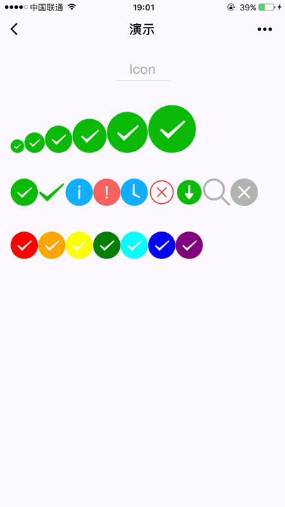
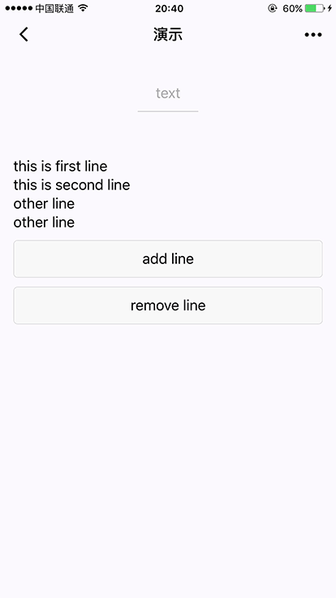

# 3.2 基础内容组件

[TOC]


## 1. icon 图标

| 属性名 | 类型   | 默认值 | 说明                                                         |
| ------ | ------ | ------ | ------------------------------------------------------------ |
| type   | String |        | icon的类型，有效值：success, success_no_circle, info, warn, waiting, cancel, download, search, clear |
| size   | Number | 23     | icon的大小，单位px                                           |
| color  | Color  |        | icon的颜色，同css的color                                     |

index.wxml

```html
<view class="group">  
  <block wx:for="{{iconSize}}">
    <icon type="success" size="{{item}}"/>
  </block>
</view>

<view class="group">
  <block wx:for="{{iconType}}">
    <icon type="{{item}}" size="40"/>
  </block>
</view>


<view class="group">
  <block wx:for="{{iconColor}}">
    <icon type="success" size="40" color="{{item}}"/>
  </block>
</view>
```

index.js

```js
Page({
  data: {
    iconSize: [20, 30, 40, 50, 60, 70],
    iconColor: [
      'red', 'orange', 'yellow', 'green', 'rgb(0,255,255)', 'blue', 'purple'
    ],
    iconType: [
      'success', 'success_no_circle', 'info', 'warn', 'waiting', 'cancel', 'download', 'search', 'clear'
    ]
  }
})
```



## 2. text 文本


- decode可以解析的有 `&nbsp;` `&lt;` `&gt;` `&amp;` `&apos;` `&ensp;` `&emsp;`
- 各个操作系统的空格标准并不一致。
- `<text/>` 组件内只支持 `<text/>` 嵌套。
- 除了文本节点以外的其他节点都无法长按选中。

**示例：**

index.wxml

```html
<view class="btn-area">
  <view class="body-view">
    <text>{{text}}</text>
    <button bindtap="add">add line</button>
    <button bindtap="remove">remove line</button>
  </view>
</view>
```

index.js

```js
var initData = 'this is first line\nthis is second line'
var extraLine = [];
Page({
  data: {
    text: initData
  },
  add: function(e) {
    extraLine.push('other line')
    this.setData({
      text: initData + '\n' + extraLine.join('\n')
    })
  },
  remove: function(e) {
    if (extraLine.length > 0) {
      extraLine.pop()
      this.setData({
        text: initData + '\n' + extraLine.join('\n')
      })
    }
  }
})
```




## 3. richtext 富文本

支持默认事件，包括：tap、touchstart、touchmove、touchcancel、touchend和longtap

nodes 属性推荐使用 Array 类型，由于组件会将 String 类型转换为 Array 类型，因而性能会有所下降

nodes: 现支持两种节点，通过type来区分，分别是元素节点和文本节点，默认是元素节点，在富文本区域里显示的HTML节点

元素节点：type = node

**BUG & TIPS**

1. `tip`: nodes 不推荐使用 String 类型，性能会有所下降。
2. `tip`: `rich-text` 组件内屏蔽所有节点的事件。
3. `tip`: attrs 属性不支持 id ，支持 class 。
4. `tip`: name 属性大小写不敏感。
5. `tip`: 如果使用了不受信任的HTML节点，该节点及其所有子节点将会被移除。
6. `tip`: img 标签仅支持网络图片。
7. `tip`: 如果在自定义组件中使用 `rich-text` 组件，那么仅自定义组件的 wxss 样式对 `rich-text` 中的 class 生效。


示例代码：

index.wxml

```html
<!-- rich-text.wxml -->
<rich-text nodes="{{nodes}}" bindtap="tap"></rich-text>
```

index.js

```js
Page({
  data: {
    nodes: [{
      name: 'div',
      attrs: {
        class: 'div_class',
        style: 'line-height: 60px; color: red;'
      },
      children: [{
        type: 'text',
        text: 'Hello&nbsp;World!'
      }]
    }]
  },
  tap() {
    console.log('tap')
  }
})
```

## 4. progress 进度条示例代码

index.wxml

```html
<progress percent="20" show-info />
<progress percent="40" stroke-width="12" />
<progress percent="60" color="pink" />
<progress percent="80" active />
```


