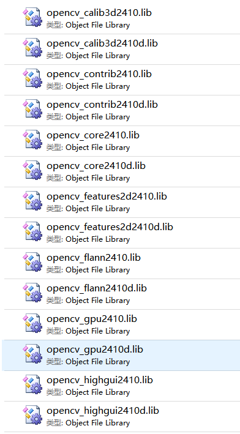
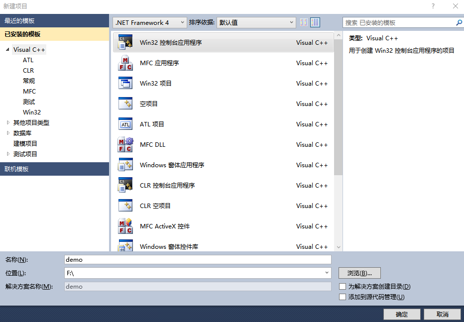
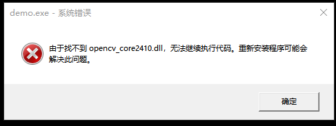

# 教程0：OpenCV+VS2010环境配置

首先介绍一下VS版本，一般在opencv中vc10表示VS2010，vc11表示VS2012，vc12表示VS2013。目前比较新的opencv已经支持到vc14，vc15。软件版本更新太快，但并不影响我们对代码的研究

## 1. opencv配置

首先你可以到opencv的官方网站下载（免费的），opencv的版本很多，可以找一个网络上配置教程比较多的版本，因为这样方便你解决问题。还有一个问题，那就是从官网下的opencv只支持vc11/vc12，那样你可以选择别的，比如opencv2.4.10可以支持vc10/vc11/vc12，opencv2.4.12支持vc11/vc12了。因为不喜欢vs12的风格，还是坚持用vs10了。

​ opencv下载官网：<http://opencv.org/>

按照我的编程习惯，不喜欢在系统中安装opencv，然后把它添加到系统环境变量。因为有时项目换一台电脑运行时，因为opencv安装的目录不同，容易导致程序无法运行。因此，我给出一种便捷的方法。

opencv在使用中，只需要用到三种文件：头文件、lib文件、dll文件。我已经把这三种文件从安装包中提取出来，方便同学们自由下载。地址如下：https://ouceducn-my.sharepoint.com/:u:/g/personal/gaofeng_ouc_edu_cn/ESqfsEXDek9KgOio3cuz3ikBVg7lF6jbIvtG6AgctCSXrg?e=nYszjD


其中，头文件就是在程序编译时需要的头文件，releasebin就是程序在运行中可能会用到的dll动态链接库文件，releaselib就是程序在编程过程中需要链接的库文件。

其实，当你按照网络教程安装opencv以后，会在opencv\build\x86\vc10\lib目录下看到很多的lib文件。这些都是opencv作者们在vs2010下编译得到的。但是我们知道，**编译分为debug和release两种模式。** Debug 通常称为调试版本，它包含调试信息，并且不作任何优化，便于程序员调试程序。Release 称为发布版本，它往往是进行了各种优化，使得程序在代码大小和运行速度上都是最优的，以便用户很好地使用。 在这里，大家可以看到，文件结尾带字母"d"的，就是debug模式下编译得到的lib文件。不带字母"d"的，就是release模式下编译得到的lib文件。



因为本人在做项目过程中，基本上很少使用debug模式，所以开发中，一般只使用release版本的库。所以，我提供的都是release版本的lib和dll文件。

##2. 安装Visual Stuido 2010

这个就不用详述了，点击setup，直接下一步下一步就可以了。需要注意的是，因为我们使用的只是visual c++这个模块，在安装的时候可以选择自定义，然后只选中这个模块，其它模块忽略就可以了。


安装完成以后，直接打开visual studio 直接新建一个名为demo的空项目，类型中win32控制台应用程序。



给项目添加一个CPP文件，名为main.cpp。先添加头部引用，如下：

```c++
#include <iostream>
#include "opencv2/core/core.hpp"
#include "opencv2/imgproc/imgproc.hpp"
#include "opencv2/highgui/highgui.hpp"

using namespace cv;
using namespace std;
```

可以发现，头文件的引用上会提示错误。因为当前目录下并没有opencv的头文件。因此，把头文件opencv和opencv2两个文件夹拷到当前项目目录里，再次编译就能找到头文件了。

接着，再添加下述代码：

```c++
int main()
{
	Mat img = imread("1.png");

	namedWindow("demo");  
    imshow("demo", img);  

	return 0;
}
```

在运行过程中，发现会提示 error LNK2001: 无法解析的外部符号"void __cdel cv::namedWindow"。这是因为光有头文件，没有lib文件引起的。所以，我们要这引入lib文件。这里具体方式是，把需要用到的lib文件拷到项目目录下，然后添加代码如下：

```c++
#pragma comment(lib, "opencv_core2410.lib")
#pragma comment(lib, "opencv_highgui2410.lib")
#pragma comment(lib, "opencv_imgproc2410.lib")
```

这样就能编译通过了。但是，当我们执行程序时，系统会报错：



这是因为运行时，还需要提供opencv的动态链接库。需要哪个动态链接库，把它拷到项目的Release目录下，程序就可以运行了。


